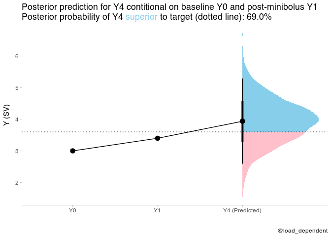
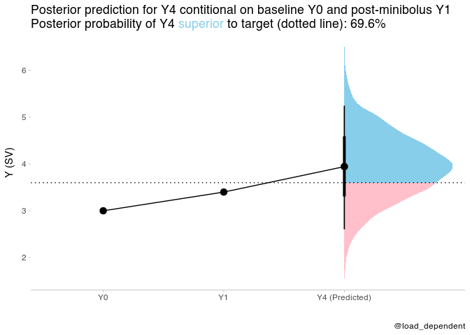

Fluid responsiveness simulation
================

Simulation of fluid responsiveness prediction trial, by mini-fluid
boluses, using predictions from a bayesian linear model.

[Shiny app for interactive
simulation](https://lmsaxhaug.shinyapps.io/fluid_response_sim/)

Simulate data, based on
[this](https://discourse.datamethods.org/t/calculating-correlation-between-consecutive-changes-dealing-with-spurious-correlation/4528/6)
[datamethods.org](datamethods.org) discussion

``` r
set.seed(1349)

n <- 1000
# true values
Y0 <- rnorm(n, 5, 1)

a <- rnorm(n, 0, 1) # change
Y1 <- Y0 + a/2
Y4 <- Y1 + a

# add independent random noise
Y0 <- Y0 + rnorm(n, 0, 0.2)
Y1 <- Y1 + rnorm(n, 0, 0.2)
Y4 <- Y4 + rnorm(n, 0, 0.2)
df <- tibble(Y0,Y1,Y4)
```

Fit models, using flat priors (for simplicity)

``` r
model1 <- brm(Y4 ~ 0 + Y0 + Y1,
          data = df,
          file = here("fluid_response","model1.Rds"),
          file_refit= "on_change"
          )
model1
```

    ##  Family: gaussian 
    ##   Links: mu = identity; sigma = identity 
    ## Formula: Y4 ~ 0 + Y0 + Y1 
    ##    Data: df (Number of observations: 1000) 
    ## Samples: 4 chains, each with iter = 2000; warmup = 1000; thin = 1;
    ##          total post-warmup samples = 4000
    ## 
    ## Population-Level Effects: 
    ##    Estimate Est.Error l-95% CI u-95% CI Rhat Bulk_ESS Tail_ESS
    ## Y0    -1.37      0.04    -1.44    -1.30 1.00     1271     1585
    ## Y1     2.37      0.04     2.30     2.44 1.00     1288     1546
    ## 
    ## Family Specific Parameters: 
    ##       Estimate Est.Error l-95% CI u-95% CI Rhat Bulk_ESS Tail_ESS
    ## sigma     0.68      0.02     0.65     0.71 1.01     1758     1667
    ## 
    ## Samples were drawn using sampling(NUTS). For each parameter, Bulk_ESS
    ## and Tail_ESS are effective sample size measures, and Rhat is the potential
    ## scale reduction factor on split chains (at convergence, Rhat = 1).

New values for Y0 and Y1 to predict Y4 from, and minimum SV to target

``` r
Y0_new <- 3.0
Y1_new <- 3.4
Y4_target <- 3.6 #minimum co target
```

Generate posterior predictions based on Y0 and Y1

``` r
prediction <- tibble(Y0=Y0_new,Y1=Y1_new) %>%
  add_predicted_draws(model1)

head(prediction)
```

    ## # A tibble: 6 × 7
    ## # Groups:   Y0, Y1, .row [1]
    ##      Y0    Y1  .row .chain .iteration .draw .prediction
    ##   <dbl> <dbl> <int>  <int>      <int> <int>       <dbl>
    ## 1     3   3.4     1     NA         NA     1        4.53
    ## 2     3   3.4     1     NA         NA     2        4.81
    ## 3     3   3.4     1     NA         NA     3        3.80
    ## 4     3   3.4     1     NA         NA     4        4.03
    ## 5     3   3.4     1     NA         NA     5        4.16
    ## 6     3   3.4     1     NA         NA     6        2.94

Calculate posterior probability of Y4 superior to target

``` r
post_pred_prob <- prediction %>%
  summarise(prob=mean(.prediction>Y4_target)) %>%
  pull(prob)
```

    ## `summarise()` has grouped output by 'Y0', 'Y1'. You can override using the `.groups` argument.

Data for points and lines

``` r
plot_data = tibble(time=ordered(c("Y0","Y1","Y4 (Predicted)")),y=c(Y0_new,Y1_new,mean(prediction$.prediction)),group="group")
```

``` r
plot_data %>%
  ggplot(aes(x = time, y = y,group="group")) +
  stat_halfeye(aes(y = .prediction, x = "Y4 (Predicted)", fill = after_stat(ifelse(y > Y4_target, "over", "under"))), data = prediction) +
  geom_point(size=3)+
  geom_path()+
  geom_hline(yintercept = Y4_target,linetype="dotted")+
  scale_fill_manual(values = c("over" = "#87ceeb", "under" = "#FFC0CB")) +
  scale_y_continuous(name = "Y (SV)")+
  scale_x_discrete(name="")+
  theme_tidybayes() +
  labs(title = paste0(
    "Posterior prediction for Y4 contitional on baseline Y0 and post-minibolus Y1 <br>",
    "Posterior probability of Y4 <span style='color:#87ceeb;'>superior</span> to target (dotted line): ", scales::percent(post_pred_prob, accuracy = .1)
  ),caption = "@load_dependent") +
  theme(
    legend.position = "none", axis.line.y = NULL,
    plot.title = element_markdown(lineheight = 1.1),
    legend.text = element_markdown(size = 11)
  )
```

<!-- -->

## An alternative approach

We can also fit the model using change from Y0 to Y1 `I(Y1 - Y0)` and
the mean `I((Y1 + Y0) / 2)` of the two values.

``` r
model2 <- brm(Y4 ~ 0 + I(Y1 - Y0) + I((Y1 + Y0) / 2),
          data = df,
          file = here("fluid_response","model2.Rds"),
          file_refit= "on_change"
          )
model2
```

    ##  Family: gaussian 
    ##   Links: mu = identity; sigma = identity 
    ## Formula: Y4 ~ 0 + I(Y1 - Y0) + I((Y1 + Y0)/2) 
    ##    Data: df (Number of observations: 1000) 
    ## Samples: 4 chains, each with iter = 2000; warmup = 1000; thin = 1;
    ##          total post-warmup samples = 4000
    ## 
    ## Population-Level Effects: 
    ##          Estimate Est.Error l-95% CI u-95% CI Rhat Bulk_ESS Tail_ESS
    ## IY1MY0       1.87      0.04     1.79     1.95 1.00     3308     2886
    ## IY1PY0D2     1.00      0.00     0.99     1.01 1.00     4722     3222
    ## 
    ## Family Specific Parameters: 
    ##       Estimate Est.Error l-95% CI u-95% CI Rhat Bulk_ESS Tail_ESS
    ## sigma     0.68      0.02     0.65     0.71 1.00     2948     2814
    ## 
    ## Samples were drawn using sampling(NUTS). For each parameter, Bulk_ESS
    ## and Tail_ESS are effective sample size measures, and Rhat is the potential
    ## scale reduction factor on split chains (at convergence, Rhat = 1).

The estimate for `I((Y1 + Y0) / 2)` is 1, indicating that the expected
difference between the Y4 and the mean of Y1 and Y0 only depend on the
difference between Y0 and Y1. I.e. with this simulated data, we only
need to consider the change from Y0 to Y1 to predict the change from
mean(Y0, Y1) to Y4 (which is similar to the current use of the MFC
approach).

I believe the models are equivalent though, so it should be possible to
draw the same insight from the more attractive model 1.

*The following is just the same predictions as above, but for model 2.
They are equivalent.*

Generate posterior predictions based on Y0 and Y1

``` r
prediction2 <- tibble(Y0=Y0_new,Y1=Y1_new) %>%
  add_predicted_draws(model2)

head(prediction2)
```

    ## # A tibble: 6 × 7
    ## # Groups:   Y0, Y1, .row [1]
    ##      Y0    Y1  .row .chain .iteration .draw .prediction
    ##   <dbl> <dbl> <int>  <int>      <int> <int>       <dbl>
    ## 1     3   3.4     1     NA         NA     1        4.83
    ## 2     3   3.4     1     NA         NA     2        5.85
    ## 3     3   3.4     1     NA         NA     3        3.94
    ## 4     3   3.4     1     NA         NA     4        2.80
    ## 5     3   3.4     1     NA         NA     5        3.64
    ## 6     3   3.4     1     NA         NA     6        3.92

Calculate posterior probability of Y4 superior to target

``` r
post_pred_prob2 <- prediction2 %>%
  summarise(prob=mean(.prediction>Y4_target)) %>%
  pull(prob)
```

    ## `summarise()` has grouped output by 'Y0', 'Y1'. You can override using the `.groups` argument.

Data for points and lines

``` r
plot_data2 = tibble(time=ordered(c("Y0","Y1","Y4 (Predicted)")),y=c(Y0_new,Y1_new,mean(prediction2$.prediction)),group="group")
```

``` r
plot_data2 %>%
  ggplot(aes(x = time, y = y,group="group")) +
  stat_halfeye(aes(y = .prediction, x = "Y4 (Predicted)", fill = after_stat(ifelse(y > Y4_target, "over", "under"))), data = prediction2) +
  geom_point(size=3)+
  geom_path()+
  geom_hline(yintercept = Y4_target,linetype="dotted")+
  scale_fill_manual(values = c("over" = "#87ceeb", "under" = "#FFC0CB")) +
  scale_y_continuous(name = "Y (SV)")+
  scale_x_discrete(name="")+
  theme_tidybayes() +
  labs(title = paste0(
    "Posterior prediction for Y4 contitional on baseline Y0 and post-minibolus Y1 <br>",
    "Posterior probability of Y4 <span style='color:#87ceeb;'>superior</span> to target (dotted line): ", scales::percent(post_pred_prob2, accuracy = .1)
  ),caption = "@load_dependent") +
  theme(
    legend.position = "none", axis.line.y = NULL,
    plot.title = element_markdown(lineheight = 1.1),
    legend.text = element_markdown(size = 11)
  )
```

<!-- -->
